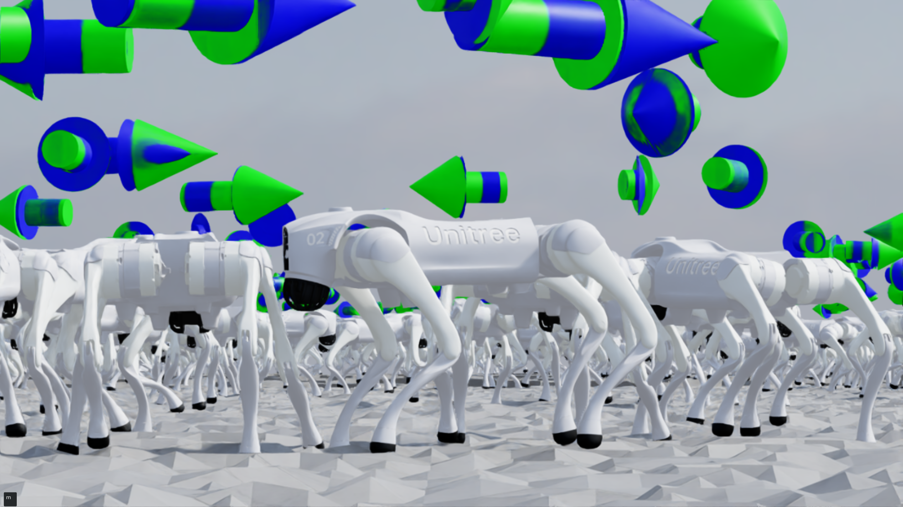
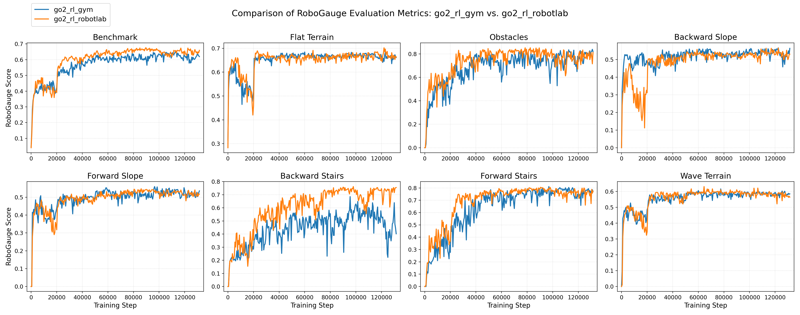

# LegBot RL RobotLab

<div align="center">

**MoE-CTS: Mixture of Experts Concurrent Teacher-Student Reinforcement Learning for Quadruped Locomotion**

[中文文档 (Chinese README)](README_cn.md) | [技术文档 (Technical Doc)](TECHNICAL_DOC_zh.md)

</div>

---

## Overview

**LegBot RL RobotLab** is an NVIDIA IsaacLab-based reinforcement learning training and deployment framework for the LegBot quadruped robot. It implements the **MoE-CTS (Mixture of Experts – Concurrent Teacher-Student)** algorithm — the official IsaacLab implementation of the [CTS](https://arxiv.org/pdf/2405.10830) paper and a reimplementation of [go2_rl_gym](https://github.com/wty-yy/go2_rl_gym).

LegBot is a custom quadruped robot sharing the same 12-joint kinematic structure as Unitree Go2 (4 legs × 3 joints: hip, thigh, calf), enabling direct reuse of MDP modules.

<p align="center">
  <b>Train in IsaacLab → Verify via MuJoCo Sim2Sim → Deploy on Real Robot</b>
</p>

<p align="center">
  
</p>

---

## Algorithm: MoE-CTS

### Core Idea

MoE-CTS combines **PPO** with **Concurrent Teacher-Student distillation** and introduces a **Mixture of Experts (MoE)** mechanism in the student encoder.

During training, environments are split into two groups:
- **Teacher environments (75%)**: Use the teacher encoder with privileged observations (critic obs: linear velocity, height scans, joint torques, etc.)
- **Student environments (25%)**: Use the student MoE encoder with deployable observations only (actor obs: angular velocity, gravity direction, joint states, commands)

Both groups share the same Actor and Critic networks; only the encoders differ. The student learns to mimic the teacher's latent representations via distillation loss. At deployment time, only the student branch is used — no privileged information required.

### Algorithm Flow

```
For each training iteration:

1. Rollout (num_steps_per_env=24 steps):
   - Teacher envs: obs → TeacherEncoder → latent → Actor → action
   - Student envs: obs → StudentMoEEncoder → latent → Actor → action
   Environment executes actions, stores transitions

2. Compute returns (GAE):
   δ_t = r_t + γ·V(s_{t+1}) - V(s_t)
   A_t = δ_t + γ·λ·A_{t+1}
   R_t = A_t + V(s_t)

3. PPO Update (5 epochs × 4 mini-batches):
   - Policy Loss:   L_policy = -E[min(r·A, clip(r)·A)]
   - Value Loss:    L_value  = E[(V - R)²]
   - Entropy Bonus: L_entropy = -β·H[π]

4. Student Encoder Distillation:
   - Latent Loss:     L_latent  = ||StudentEncoder(o_a) - TeacherEncoder(o_c).detach()||²
   - Load Balance Loss: L_balance = ||mean(gates) - 1/N||²
   - Student Total:   L_student = L_latent + α·L_balance, α=0.01
```

### Network Architecture

#### Teacher Encoder
```
z_t = L2Norm(MLP_teacher(o_c))
```
- Input: critic observations (privileged)
- Structure: MLP[512, 256] → L2Norm
- Output: latent_dim = 32

#### Student MoE Encoder
```
g   = Softmax(MLP_gate(o_a))
e_i = Expert_i(Backbone(o_a)),  i=1,...,N
z_s = L2Norm(Σ g_i · e_i)
```
- Number of experts: N = 8
- Shared backbone: MLP[512, 256, 256]
- Each expert: Conv1d(groups=8)
- Gating network: MLP[512, 256, 256] → Softmax
- Output: latent_dim = 32

#### Actor (Policy Network)
```
a ~ N(μ, σ²),   μ = MLP_actor([z, o_single])
```
- Input: [latent(32), single_obs(45)] = 77 dims
- Structure: MLP[512, 256, 128] → 12 (action dim)
- Standard deviation: learnable scalar parameter

#### Critic (Value Network)
```
V(s) = MLP_critic([z.detach(), o_c])
```
- Input: [latent(32), critic_obs]
- Structure: MLP[512, 256, 128] → 1

### PPO Objective

$$L_{\text{PPO}} = -\mathbb{E}\left[\min\left(r_t A_t, \text{clip}(r_t, 1-\epsilon, 1+\epsilon) A_t\right)\right] + c_v \cdot L_{\text{value}} - c_e \cdot H[\pi]$$

where:
$$r_t = \frac{\pi_\theta(a_t|s_t)}{\pi_{\theta_{\text{old}}}(a_t|s_t)}, \quad \epsilon = 0.2$$

---

## Project Structure

```
legbot_lab/
├── scripts/rsl_rl/              # Training & evaluation entry points
│   ├── train.py                 # Training entry
│   ├── play.py                  # Evaluation + policy export
│   ├── cli_args.py              # CLI arguments
│   └── rsl_rl_utils.py          # Logging & export utilities
├── source/
│   ├── robot_lab/               # Environment & task definitions
│   │   └── robot_lab/
│   │       ├── assets/          # Robot assets, actuator configs
│   │       │   ├── legbot.py    # LegBot robot configuration
│   │       │   └── unitree_actuator.py  # Unitree motor model
│   │       └── tasks/
│   │           ├── go2/         # Go2 MDP modules (reused by LegBot)
│   │           │   ├── mdp/     # Rewards, observations, commands, etc.
│   │           │   └── manager/ # Action manager
│   │           └── legbot/      # LegBot-specific configs
│   │               ├── env_cfg.py      # Environment configuration
│   │               ├── rsl_rl_cfg.py   # RL algorithm configuration
│   │               └── env/legbot_env.py  # Environment class
│   └── rsl_rl/                  # Custom RSL-RL library
│       └── rsl_rl/
│           ├── algorithms/moe_cts.py        # MoE-CTS algorithm core
│           ├── modules/actor_critic_moe_cts.py  # Teacher-student network
│           ├── networks/moe.py             # MoE network implementation
│           ├── runners/on_policy_runner_cts.py  # CTS training loop
│           ├── storage/rollout_storage_cts.py   # CTS rollout storage
│           └── utils/exporter_cts.py       # Policy exporter
├── deploy/deploy_mujoco/        # MuJoCo Sim2Sim deployment
│   ├── deploy_legbot.py         # Deployment script
│   ├── utils.py                 # Deployment utilities
│   └── configs/legbot.yaml      # Deployment configuration
├── resources/legbot/            # MuJoCo scenes & URDF
│   ├── urdf/legbot.urdf         # LegBot URDF model
│   ├── meshes/                  # STL mesh files
│   ├── flat.xml                 # Flat terrain scene
│   ├── stairs.xml               # Stairs scene
│   ├── boxes.xml                # Box obstacles scene
│   └── legbot.xml               # LegBot MuJoCo model
├── src/                         # C++ simulation & bridge
│   ├── legbot_bridge.h          # DDS bridge for MuJoCo
│   ├── param.h                  # Simulation config
│   └── main.cc                  # MuJoCo simulation main
├── logs/rsl_rl/legbot_moe_cts/  # Training logs & checkpoints
├── TECHNICAL_DOC_zh.md          # Detailed technical documentation (Chinese)
└── README.md                    # This file
```

---

## MDP Definition

### Observation Space

| Group | Purpose | History | Noisy | Components |
|-------|---------|---------|-------|------------|
| **policy** (actor obs) | Student encoder input | 10 | Yes | base_ang_vel, projected_gravity, velocity_commands, joint_pos, joint_vel, last_action |
| **critic** (critic obs) | Teacher/Critic input | 1 | No | All above + base_lin_vel, joint_acc, joint_torque, contact_force, height_scan |
| **single_obs** | Actor concatenation | 1 | Yes | Same as policy, current frame only |

### Action Space
- Type: Joint position control (`JointPositionAction`)
- Dimensions: 12
- Scale: 0.25 (action × 0.25 + default pose → target joint angle)

### Command Space
- Dimensions: 3 — `[lin_vel_x, lin_vel_y, ang_vel_yaw]`
- Resample interval: 5s
- Range curriculum: expands at 20k and 50k iterations

### Termination
- Timeout: 25s per episode
- Illegal contact: base link contact force > 1.0N

---

## Reward Design

### Tracking Rewards (positive)

**Linear velocity tracking** (exponential kernel):

$$r_{\text{lin}} = \exp\left(-\frac{\|v_{\text{cmd}}^{xy} - v_{\text{base}}^{xy}\|^2}{\sigma^2}\right), \quad \sigma=0.5, \quad w=1.0$$

**Angular velocity tracking**:

$$r_{\text{ang}} = \exp\left(-\frac{(\omega_{\text{cmd}}^{z} - \omega_{\text{base}}^{z})^2}{\sigma^2}\right), \quad \sigma=0.5, \quad w=0.5$$

### Penalty Terms (negative)

| Term | Formula | Weight |
|------|---------|--------|
| Vertical velocity | $\|v_z\|^2$ | -2.0 → 0 (curriculum) |
| Roll/pitch angular vel | $\|\omega_{xy}\|^2$ | -0.05 |
| Joint acceleration | $\sum \ddot{q}_i^2$ | -1e-7 |
| Joint power | $\sum \|\dot{q}_i \cdot \tau_i\|$ | -2e-5 |
| Joint torques | $\sum \tau_i^2$ | -1e-4 |
| Base height | $(h - 0.28)^2$ | -1.0 → -10.0 (curriculum) |
| Action rate | $\|a_t - a_{t-1}\|^2$ | -0.01 |
| Action smoothness | $\|a_t - 2a_{t-1} + a_{t-2}\|^2$ | -0.01 |
| Undesired contacts | $\sum \mathbb{1}(\|F\| > 5)$ | -1.0 |
| Joint position limits | Joint limit violation | -2.0 |
| Foot sliding | $\sum v_{\text{foot}}^{xy\,2} \cdot e^{-h_{\text{foot}}/\text{threshold}}$ | -0.05 |
| Hip position penalty | $\sum \|q_{\text{hip}} - q_{\text{default}}\|_1$ | -0.05 |

---

## Domain Randomization

| Parameter | Mode | Range |
|-----------|------|-------|
| Base mass | startup | ±1 kg |
| Other body mass | startup | ×[0.9, 1.1] |
| Center of mass | startup | ±0.05 m |
| Joint reset position | reset | ×[0.5, 1.5] |
| Actuator gains (kp/kd) | reset | ×[0.9, 1.1] |
| Motor zero offset | reset | ±0.035 rad |
| Push perturbation | interval (4s) | ±0.4 m/s, ±0.6 rad/s |
| Friction coefficient | startup | [0, 2.0] |
| Base initial state | reset | pos ±0.5m, yaw ±π |

### Unitree Motor Model

The project uses the official Unitree motor torque-speed curve model (Go2 HV parameters):

| Parameter | Value | Description |
|-----------|-------|-------------|
| X1 | 13.5 rad/s | Max speed at full torque |
| X2 | 30 rad/s | No-load speed |
| Y1 | 20.2 N·m | Peak torque (same direction) |
| Y2 | 23.4 N·m | Peak torque (opposite direction) |

Friction model:

$$\tau_{\text{applied}} = \tau_{\text{PD}} - F_s \cdot \tanh\left(\frac{\dot{q}}{V_a}\right) - F_d \cdot \dot{q}$$

---

## Key Hyperparameters

| Parameter | Value | Description |
|-----------|-------|-------------|
| num_envs | 4096 | Parallel environments |
| num_steps_per_env | 24 | Steps per iteration |
| max_iterations | 300000 | Maximum training iterations |
| save_interval | 500 | Checkpoint save interval |
| num_learning_epochs | 5 | PPO epochs |
| num_mini_batches | 4 | Mini-batches per epoch |
| learning_rate | 1e-3 | Adaptive learning rate |
| student_encoder_lr | 1e-3 | Student encoder LR |
| gamma | 0.99 | Discount factor |
| lam | 0.95 | GAE lambda |
| clip_param | 0.2 | PPO clip range |
| entropy_coef | 0.01 | Entropy coefficient |
| value_loss_coef | 1.0 | Value loss coefficient |
| load_balance_coef | 0.01 | MoE load balance coefficient |
| teacher_env_ratio | 0.75 | Teacher environment ratio |
| desired_kl | 0.01 | Target KL divergence |
| max_grad_norm | 1.0 | Gradient clipping |
| expert_num | 8 | Number of MoE experts |
| latent_dim | 32 | Latent vector dimension |
| history_length | 10 | Observation history length |
| sim_dt | 0.005 s | Physics timestep |
| control_decimation | 4 | 50 Hz control frequency |
| episode_length_s | 25.0 | Max episode duration |

---

## Installation

### 1. Install IsaacLab

Follow the [official guide](https://isaac-sim.github.io/IsaacLab/v2.3.2/source/setup/installation/isaaclab_pip_installation.html):

```bash
conda create -n legbot_lab python=3.11
conda activate legbot_lab
pip install --upgrade pip
pip install isaaclab[isaacsim,all]==2.3.2.post1 --extra-index-url https://pypi.nvidia.com
pip install -U torch==2.7.0 torchvision==0.22.0 --index-url https://download.pytorch.org/whl/cu128
```

### 2. Install Custom RSL-RL and RobotLab

```bash
python -m pip install -e source/robot_lab
python -m pip install -e source/rsl_rl
```

### 3. Install MuJoCo (optional, for Sim2Sim)

```bash
pip install mujoco pygame
```

---

## Training & Evaluation

```bash
# Train
python scripts/rsl_rl/train.py --task=RobotLab-Legbot-v0 --headless

# Evaluate
python scripts/rsl_rl/play.py --task=RobotLab-Legbot-v0
```

### With RoboGauge Evaluation

[RoboGauge](https://github.com/wty-yy/robogauge) provides an asynchronous evaluation platform for locomotion RL policies:

```bash
# Terminal 1: Start RoboGauge server
python robogauge/scripts/server.py --port 9973 --num-processes 32

# Terminal 2: Train with evaluation
python scripts/rsl_rl/train.py --task=RobotLab-Legbot-v0 --headless --robogauge --robogauge_port 9973
```

### CLI Flags

```bash
python scripts/rsl_rl/train.py \
    --task=RobotLab-Legbot-v0 \
    --headless \
    --num_envs <N> \
    --max_iterations <N> \
    --experiment_name <name> \
    --run_name <name> \
    --checkpoint <path>
```

---

## MuJoCo Sim2Sim Deployment

### Export Policy

Running `play.py` automatically exports policies in both TorchScript (`.pt`) and ONNX (`.onnx`) formats:

```bash
python scripts/rsl_rl/play.py \
    --task=RobotLab-Legbot-v0 \
    --checkpoint logs/rsl_rl/legbot_moe_cts/<run_name>/model_<iter>.pt
```

### Deploy in MuJoCo

Configure `deploy/deploy_mujoco/configs/legbot.yaml` with your policy path:

```yaml
policy_path: "{ROOT_DIR}/logs/rsl_rl/legbot_moe_cts/<timestamp>/exported/policy.pt"
```

Run deployment:

```bash
python deploy/deploy_mujoco/deploy_legbot.py
```

### Switch Scenes

Modify `xml_path` in `legbot.yaml`:

```yaml
# Flat terrain
xml_path: "{ROOT_DIR}/resources/legbot/flat.xml"
# Stairs
xml_path: "{ROOT_DIR}/resources/legbot/stairs.xml"
# Box obstacles
xml_path: "{ROOT_DIR}/resources/legbot/boxes.xml"
```

### Controller Mapping

| Input | Function |
|-------|----------|
| LX / LY | Forward / Lateral velocity |
| RX | Angular velocity (yaw) |

---

## RoboGauge Benchmark Results

<p align="center">
  
</p>

### Best Scores within 150k Training Steps

| Model | Total | Tracking | Safety | Quality | Levels |
|-------|-------|----------|--------|---------|--------|
| **go2_moe_cts (this project)** | **0.6828** | **0.6785** | 0.7552 | **0.7645** | **8.17** |
| go2_moe_cts (go2_rl_gym) | 0.6713 | 0.6669 | **0.7857** | 0.7392 | 7.85 |
| CTS (original) | 0.5786 | 0.5755 | 0.7066 | 0.6624 | 6.83 |
| HIM | 0.5379 | 0.5453 | 0.6476 | 0.6050 | 6.19 |
| DreamWaQ | 0.5054 | 0.5105 | 0.6149 | 0.5730 | 5.74 |

---

## Differences from go2_rl_gym

- **Motor model**: Uses the official Unitree torque-speed-curve motor model instead of a simple PD controller
- **Rewards**: Different tracking reward form (fixed sigma vs. dynamic sigma); reduced `joint_acc_l2` weight due to physics-step-level computation in IsaacLab; added `joint_pos_penalty_l1` for better performance
- **Domain randomization**: Motor-level delay instead of random action delay; no motor strength randomization (Lab constraint)
- **History length**: 10 (vs. 5 in Gym), as longer history performs better in IsaacLab
- **Algorithm**: MoE-CTS with 8 expert networks in student encoder

---

## Acknowledgments

This project would not exist without:

- [IsaacLab](https://github.com/isaac-sim/IsaacLab) — Unified robot learning framework on NVIDIA Isaac Sim
- [rsl_rl](https://github.com/leggedrobotics/rsl_rl) — Reinforcement learning algorithm library
- [robot_lab](https://github.com/fan-ziqi/robot_lab) — IsaacLab-based robot RL extension
- [MuJoCo](https://github.com/google-deepmind/mujoco) — High-performance physics simulator
- [go2_rl_gym](https://github.com/wty-yy/go2_rl_gym) — IsaacGym-based Go2 RL training

Relevant papers:

- [CTS: Concurrent Teacher-Student Reinforcement Learning for Legged Locomotion](https://arxiv.org/pdf/2405.10830)

---

## Citation

```bibtex
@article{go2_rl_robotlab,
  title   = {MoE-CTS: Mixture of Experts Concurrent Teacher-Student for Legged Locomotion},
  author  = {LegBot RobotLab Contributors},
  journal = {Robotics: Science and Systems (RSS)},
  year    = {2026}
}
```

## License

This project is released under the Apache 2.0 License. See individual source files for specific licensing details.
