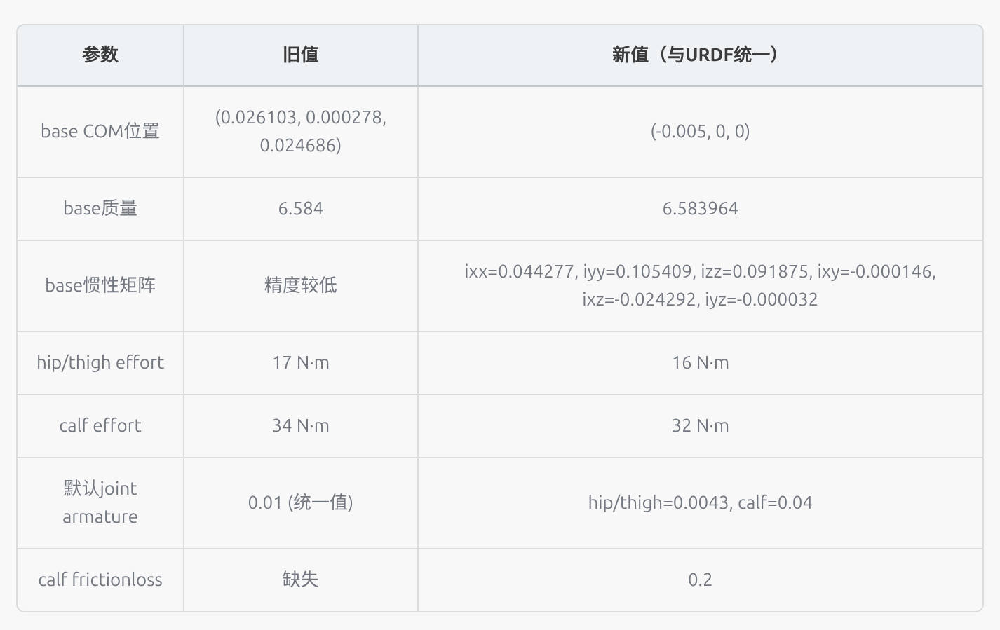

# Legbot 修改日志

---

**每次修改过的内容都汇总到修改日志中，然后日志要简要直观；**

---

## 1. 2026-06-30 — 质心位置统一

头部去掉，所以base的质心位置必须后移；

- 问题：FixStand→Velocity 切换时前腿外八，因训练 URDF 与 MuJoCo XML 质心不一致
- 修改：统一 5 个文件中的质心位置参数为 COM_x=0.0, COM_y=0.0, COM_z=0.04
- 涉及文件：legbot_description.urdf, legbot.xml, velocity_env_cfg.py 等

## 2. 2026-07-02 — URDF COM 与 legbot.xml 不一致

- 发现 URDF 中 COM_x=-0.008，legbot.xml 中 COM_x=-0.02，需同步

## 3. 2026-07-03 — 奖励函数与域随机化参数分析

- 完成velocity_env_cfg.py 中 14 个奖励项和 9 个域随机化项的全参数分析
- 记录了策略观测噪声等配置

## 4. 2026-07-05 — 前腿踏不出去 + 恒定前俯诊断修复

**问题**：RL 控制下机身恒定前俯 ~5°，前腿下压踏不出去；sim2sim 前进急停后部抬起

**根因**：URDF 基座 COM 在 (0,0,0)，默认站姿下足端中心 x=+0.0121m，COM 偏后 12mm，策略学前俯补偿

**修改**：

| # | 改动 | 文件 | 前 | 后 |
|---|------|------|----|----|
| 1 | URDF effort 修正 | legbot_description.urdf | 17/34 | 16/32 |
| 2 | URDF 加 dynamics | legbot_description.urdf | 无 | hip/calf: friction=0.1 damping=0.02, thigh: friction=0.1 damping=0.05 |
| 3 | 力矩随机化范围 | velocity_env_cfg.py | (0.85, 1.15) | (0.75, 1.05) |
| 4 | Kp/Kd | unitree.py + config.yaml | 60/4 | 70/5 |
| 5 | 动作延迟 | unitree.py | 固定 0~4步(0~20ms) | 不变 |
| 6 | Trot 步态奖励 | velocity_env_cfg.py | 无 → 加 → **删除** | 停止时仍踏步 + 外八 |

**测试结果（2026-07-06）**：
- 加 trot 步态奖励后 sim2sim 测试：停止时仍微微踏步，四腿外八
- 因此删除步态奖励，改为让策略自然学习步态

**待办**：
- 修正 URDF 基座 COM 位置
- 放大 COM 域随机化 ±0.5mm → ±20mm
- 加 pitch 惩罚项
- 提高 flat_orientation_l2 权重 -3.0 → -5.0
- 提高 ang_vel_xy_l2 权重 -0.08 → -0.5
- 排查 FL 硬件（力矩差 -66%）

## 4. 2026-07-06 — 前腿踏不出去 + 恒定前俯
**修改**：
修改urdf的base质心位置为(-0.01, 0, 0)，让策略学习靠后的动作，来补偿先前实物靠前的问题；

## 5. 2026-07-07 — 域随机化 + 奖励函数改进（参考 env_cfg.py）

**改动**：

| # | 改动 | 文件 | 前 | 后 |
|---|------|------|----|----|
| 1 | COM 随机化范围 | velocity_env_cfg.py | x:±5mm, y/z:±0.5mm | x/y/z: ±2cm |
| 2 | 其他部件质量随机化 | velocity_env_cfg.py | 缺失 | ±10% (scale), startup |
| 3 | 惯性随机化 | velocity_env_cfg.py + events.py | 缺失 | ±10% (scale), startup |
| 4 | PD 增益随机化模式 | velocity_env_cfg.py | startup | reset |
| 5 | 关节零位偏移随机化 | velocity_env_cfg.py + events.py | 缺失 | ±35mrad, reset |
| 6 | action_rate 权重 | velocity_env_cfg.py | -0.18 | -0.08 |
| 7 | hip_pos_penalty_l1 | velocity_env_cfg.py + rewards.py | 缺失 | w=-0.05 |

## 6. 2026-07-07 — 质量 & 基座 box & COM 更新（实物测量）

**问题**：实物重新称重测量后，原模型参数与实机不符

**修改**：

| # | 改动 | 文件 | 前 | 后 |
|---|------|------|----|----|
| 1 | base 质量 | 所有模型文件 | 6.584 kg | 7.09 kg |
| 2 | thigh 质量 | 所有模型文件 | 1.550 kg | 1.456 kg |
| 3 | foot 质量 | 所有模型文件 | 0.04 kg | 0.025 kg |
| 4 | hip 质量 | 不变 | 0.080 kg | 0.080 kg |
| 5 | calf 质量 | 不变 | 0.184 kg | 0.184 kg |
| 6 | base 碰撞盒 | 所有模型文件 | 267×202×138 mm | 270×210×110 mm |
| 7 | base COM | 所有模型文件 | (0, 0, 0) 或 (0, 0, 40) mm | (-12, 2, 1) mm |
| 8 | 新总质量 | — | ~14.0 kg（旧估算） | ~14.0 kg（实测不变） |

**涉及文件（共 5 个）**：
- `legbot_rl_lab/unitree_ros/robots/legbot_description/urdf/legbot_description.urdf`
- `legbot_rl_lab/unitree_ros/robots/legbot_description/legbot_training.xml`
- `legbot_rl_lab/unitree_ros/robots/legbot_description/meshes/legbot.xml`
- `legbot/xmls/legbot.xml`
- `legbot_rl_lab/source/.../robots/legbot/velocity_env_cfg.py`（注释更新）

## 7. 2026-07-07 — PD 增益 & 零位偏移改为 startup + 删除 hip 惩罚

**修改**：

| # | 改动 | 前 | 后 |
|---|------|----|----|
| 1 | PD 增益随机化模式 | reset（每episode重采样） | **startup**（训练启动时一次） |
| 2 | 关节零位偏移随机化模式 | reset | **startup** |
| 3 | hip_pos_penalty_l1 奖励 | w=-0.05 | **删除**（实机无外八，无需此惩罚） |

**涉及文件**：`velocity_env_cfg.py`
